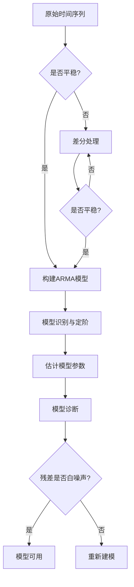

# ARIMA建模指南

---

## 1. 概念解析

**ARIMA**（AutoRegressive Integrated Moving Average，自回归积分滑动平均）是一种用于非平稳时间序列建模与预测的经典统计模型。它由Box和Jenkins在1970年代提出，是时间序列分析中最广泛使用的模型之一。

### 核心概念与意义：

- **AR（自回归）**：表示当前值与过去若干期值的线性关系。例如，AR(p) 表示当前值与前p期值有关。
- **I（积分）**：表示差分的阶数。用于将非平稳序列转化为平稳序列，d表示需要差分的次数。
- **MA（滑动平均）**：表示当前误差与过去q期误差之间的关系。MA(q) 表示误差项由前q期的随机扰动构成。

### 模型形式：
一个ARIMA(p, d, q) 模型可以表示为：

$$
(1 - \phi_1 B - \phi_2 B^2 - \cdots - \phi_p B^p)(1 - B)^d y_t = (1 + \theta_1 B + \theta_2 B^2 + \cdots + \theta_q B^q)\epsilon_t
$$

其中：
- $ B $：滞后算子（Backshift Operator）
- $ \phi_i $：自回归系数
- $ \theta_j $：滑动平均系数
- $ \epsilon_t $：白噪声误差项

### 意义与作用：
- **适用于非平稳数据**：通过差分处理趋势和季节性，使序列平稳，从而应用传统ARMA模型。
- **预测能力强**：在经济、金融、气象等领域，ARIMA被广泛用于短期趋势预测。
- **理论基础扎实**：基于统计学原理，具有良好的数学推导和解释性。

---

## 2. 知识结构

### ARIMA建模流程图

### 关键子知识点

| 模块 | 子知识点 | 描述 |
|------|----------|------|
| 数据准备 | 平稳性检验 | 使用ADF检验、KPSS检验判断序列是否平稳 |
| 数据处理 | 差分操作 | 一阶差分消除趋势，季节差分消除季节性 |
| 模型识别 | ACF/PACF分析 | 通过自相关图和偏自相关图判断p和q值 |
| 模型定阶 | AIC/BIC准则 | 选择最优模型，平衡拟合精度与复杂度 |
| 参数估计 | 极大似然估计 | 拟合ARIMA模型参数 |
| 模型诊断 | 残差检验 | 检查残差是否为白噪声，判断模型是否合理 |
| 预测与评估 | 滚动预测、RMSE等 | 对未来值进行预测并评估模型性能 |

---

## 3. 教学应用

### 3.1 真实案例

#### 案例一：零售销售预测（商业分析）

- **场景描述**：某连锁超市希望根据历史销售数据预测未来几个月的销售额，以优化库存管理。

- **应用过程**：
  1. 收集过去3年的月度销售数据。
  2. 绘制时序图发现存在上升趋势和季节性。
  3. 通过一阶差分和季节差分使序列平稳。
  4. 观察ACF/PACF图，初步定阶为ARIMA(1,1,1)(1,1,1)12。
  5. 使用AIC/BIC准则选择最优模型。
  6. 拟合模型并预测未来6个月销售额。
  7. 计算RMSE评估预测误差。

- **价值体现**：ARIMA能有效处理具有趋势和季节性的销售数据，提供准确的短期预测，辅助库存和采购决策。

#### 案例二：股票价格波动建模（金融分析）

- **场景描述**：某金融机构希望分析某股票价格的短期波动模式，用于风险评估。

- **应用过程**：
  1. 获取某股票过去一年的日收盘价。
  2. 检验序列平稳性，发现存在趋势但无明显季节性。
  3. 一阶差分后序列平稳。
  4. 通过ACF/PACF图识别为ARIMA(2,1,1)。
  5. 拟合模型并对未来5天价格进行预测。
  6. 使用MAPE评估预测精度。

- **价值体现**：ARIMA可捕捉金融时间序列中的短期波动特征，辅助短期交易策略制定。

---

### 3.2 常见误区与辨析

| 误区 | 描述 | 辨析方法 |
|------|------|----------|
| 1. 误认为ARIMA适用于所有时间序列 | ARIMA仅适用于线性、单变量、趋势/季节性明确的序列 | 识别序列特性，非线性或复杂结构建议使用SARIMA、Prophet、LSTM等 |
| 2. 忽略平稳性检验直接建模 | 导致模型无效或预测失真 | 使用ADF/KPSS检验确保序列平稳，必要时差分处理 |
| 3. 过度依赖ACF/PACF图定阶 | 容易误判p、q值 | 结合AIC/BIC准则交叉验证 |
| 4. 忽视模型诊断 | 残差不白噪声说明模型未充分拟合 | 检查残差是否为白噪声，使用Ljung-Box检验 |

---

## 4. 学习活动设计

### 活动名称：ARIMA建模实战演练

#### 活动目标：
掌握ARIMA建模全流程，包括数据平稳性检验、模型识别、参数估计、诊断与预测。

#### 活动内容与步骤：

1. **数据探索与平稳性检验（20分钟）**
   - 提供某商品的月度销量数据集。
   - 使用Python绘制时序图，观察趋势和季节性。
   - 进行ADF检验，判断是否需要差分。

2. **差分处理与ACF/PACF分析（15分钟）**
   - 对数据进行一阶或季节差分。
   - 绘制差分后的ACF/PACF图，初步判断p和q值。

3. **模型识别与参数估计（20分钟）**
   - 尝试多个ARIMA(p,d,q)组合，使用AIC/BIC选择最优模型。
   - 使用`statsmodels`库拟合模型，输出参数估计值。

4. **模型诊断与预测（20分钟）**
   - 检查残差是否为白噪声（Ljung-Box检验）。
   - 对未来6个月销量进行预测，并绘制预测图。

5. **小组讨论与汇报（15分钟）**
   - 讨论问题：
     - 为什么需要差分？如何判断差分次数？
     - 如何通过ACF/PACF图判断p和q？
     - 模型诊断中残差白噪声的意义是什么？

#### 所需工具/资源：
- Python环境（Jupyter Notebook）
- 库：`pandas`, `numpy`, `matplotlib`, `statsmodels`
- 数据集：某商品的月度销量数据（可使用公开数据集）

---

## 5. 评估与反馈

### 形成性评价问题：

1. **问题一：什么是ARIMA模型中的差分操作？它的作用是什么？**
   - **评估标准：**
     - **优秀**：能准确说明差分用于消除趋势和季节性，使序列平稳，d为差分次数。
     - **合格**：知道差分可以去除趋势，但对季节差分或平稳性理解不清晰。
     - **待提高**：无法解释差分的作用或与平稳性无关。

2. **问题二：如何通过ACF和PACF图判断ARIMA模型的p和q值？**
   - **评估标准：**
     - **优秀**：能解释AR(p)在PACF上截尾、MA(q)在ACF上截尾，结合图示判断p和q。
     - **合格**：知道ACF和PACF用于定阶，但描述不准确。
     - **待提高**：不了解ACF/PACF与模型定阶的关系。

3. **问题三：模型诊断中为什么要检查残差是否为白噪声？如果残差不是白噪声说明什么问题？**
   - **评估标准：**
     - **优秀**：能说明白噪声表示模型已充分拟合，若不是白噪声说明模型未捕捉到序列中的信息，需重新建模。
     - **合格**：知道残差应为白噪声，但解释不完整。
     - **待提高**：不清楚模型诊断的意义或残差分析的目的。

---