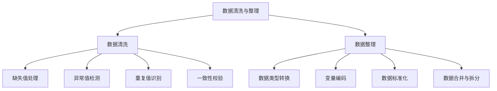

# 知识点名称：数据清洗与整理指南

---

## 1. 概念解析

### 什么是数据清洗与整理？

**数据清洗与整理**是指在数据分析或建模之前，对原始数据进行检查、修正、转换和标准化的一系列过程。其核心目标是提高数据质量，确保后续分析结果的准确性和可靠性。

### 核心概念与意义

- **数据清洗（Data Cleaning）**：识别并修正数据集中的错误、重复、缺失或异常值。
- **数据整理（Data Wrangling）**：将数据转换为适合分析的结构化格式，包括数据类型转换、变量编码、数据标准化等。

### 在计量经济学中的作用

在计量经济学中，高质量的数据是建立可靠模型的基础。清洗与整理能帮助研究者：

- 消除因数据质量问题导致的估计偏误；
- 提高模型的解释力和预测能力；
- 为政策分析、经济预测等提供坚实的数据支持。

---

## 2. 知识结构

### 关键子知识点详解

1. **缺失值处理**
   - 删除法：适用于缺失比例小的情况。
   - 填充法：均值、中位数、众数、插值等。
   - 预测填充：使用回归或插值模型预测缺失值。

2. **异常值检测**
   - 统计方法：Z-score、IQR（四分位距）。
   - 可视化方法：箱型图、散点图。
   - 处理方式：剔除、替换、分箱处理。

3. **变量编码**
   - 数值型变量：标准化、归一化。
   - 类别型变量：One-hot编码、Label编码、Ordinal编码。

4. **数据标准化**
   - Z-score标准化：适用于正态分布。
   - Min-Max标准化：适用于有明确上下限的数据。

5. **数据合并与拆分**
   - 合并：纵向合并（append）、横向合并（merge）。
   - 拆分：按时间、地区、样本类型等拆分数据集。

---

## 3. 教学应用

### 3.1 真实案例

#### 案例一：宏观经济数据整理（如GDP、失业率）

- **场景描述**：从多个来源（如世界银行、国家统计局）获取的GDP与失业率数据存在格式不统一、缺失值多、单位不一致等问题。
- **处理过程**：
  1. 统一单位：将不同国家的GDP统一为美元计价。
  2. 缺失值处理：对个别年份的缺失数据使用线性插值填充。
  3. 数据合并：将GDP与失业率两个数据集按年份和国家进行横向合并。
  4. 数据标准化：对GDP进行Z-score标准化以便于后续建模比较。
- **价值体现**：为构建宏观经济模型提供结构清晰、质量可控的数据基础。

#### 案例二：企业财务数据清洗（如资产负债表）

- **场景描述**：某企业在不同年份使用的会计科目不一致，存在单位混用、字段缺失、异常值等问题。
- **处理过程**：
  1. 一致性校验：将“固定资产”“固定资产净值”等字段统一命名。
  2. 异常值处理：发现某年份“资产总额”为负数，经核查为数据录入错误，进行修正。
  3. 缺失值处理：对缺失的“流动负债”字段使用上一年数据填充。
- **价值体现**：确保企业财务数据可用于时间序列分析和预测建模。

---

### 3.2 常见误区与辨析

| 误区编号 | 误区描述 | 正确认知 | 辨析方法 |
|----------|----------|----------|-----------|
| 1 | 所有缺失值都应删除 | 不应盲目删除，需根据缺失比例和机制决定 | 查看缺失比例，判断是否可填充或是否反映数据特性 |
| 2 | 异常值都是错误数据 | 异常值可能是真实极端情况，需结合业务背景判断 | 使用统计与可视化结合分析，判断是否保留或修正 |
| 3 | 所有变量都应标准化 | 并非所有变量都适合标准化，如类别变量 | 检查变量类型，选择合适处理方式 |
| 4 | 数据清洗是技术活，不需要理解业务背景 | 清洗决策应基于业务逻辑 | 与领域专家沟通，结合数据含义进行处理 |

---

## 4. 学习活动设计

### 活动名称：宏观经济数据清洗实战

#### 活动目标：

掌握数据清洗与整理的基本流程，能够使用Python工具对真实数据进行预处理。

#### 活动内容与步骤：

1. **数据导入与探索（15分钟）**
   - 使用Pandas加载一份包含GDP、人口、失业率等变量的宏观经济数据集。
   - 检查数据类型、缺失值、重复值、异常值。

2. **数据清洗（20分钟）**
   - 对缺失值进行填充（如使用线性插值）。
   - 检测并处理异常值（如使用IQR法）。
   - 删除重复记录。

3. **数据整理（20分钟）**
   - 将不同单位的GDP统一为美元计价。
   - 对“国家”变量进行One-hot编码。
   - 对数值变量进行Z-score标准化。

4. **小组讨论与汇报（15分钟）**
   - 讨论以下问题：
     - 哪些字段的缺失最影响分析？为什么？
     - 你如何判断哪些异常值应该保留？
     - 标准化对后续建模有什么帮助？

#### 所需工具/资源：

- Python环境（建议使用Jupyter Notebook）
- 库：pandas、numpy、matplotlib
- 数据集：来自世界银行或公开宏观经济数据集（如WDI）

---

## 5. 评估与反馈

### 形成性评价问题一：

**问题：在数据清洗中，如何处理缺失值？列举三种方法并说明适用场景。**

- **评估标准：**
  - **优秀**：能准确列举删除、填充、预测填充三种方法，并能结合缺失比例、数据重要性等说明适用场景。
  - **合格**：能列举方法，但解释不够具体或不完全准确。
  - **待提高**：仅能列举方法名称，无法说明适用场景或解释不清。

---

### 形成性评价问题二：

**问题：为什么在计量经济学建模前要对数据进行标准化？**

- **评估标准：**
  - **优秀**：能说明标准化有助于消除量纲影响、提高模型稳定性、便于变量比较等，并能举例说明。
  - **合格**：知道标准化有助于建模，但解释不够深入或例子不具体。
  - **待提高**：无法说明标准化的意义或认为标准化是可有可无的步骤。

---

### 形成性评价问题三：

**问题：你在处理一个包含异常值的数据集时，如何判断是否应该删除这些异常值？**

- **评估标准：**
  - **优秀**：能结合统计方法（如IQR、Z-score）和业务背景判断是否删除，并说明保留或修正的可能方式。
  - **合格**：能使用统计方法识别异常值，但未结合业务背景分析。
  - **待提高**：仅凭主观判断或直接删除所有异常值，未说明依据。

--- 