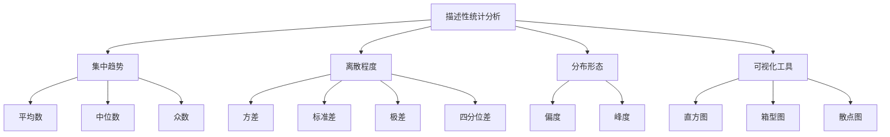

# 描述性统计分析案例教学知识点

---

## 1. 概念解析

**描述性统计分析**（Descriptive Statistical Analysis）是统计学中的基础方法，用于对数据集的特征进行总结和描述，帮助我们快速了解数据的集中趋势、离散程度、分布形态等关键信息。

### 核心概念与意义：

- **集中趋势**：反映数据的“中心位置”，常用指标包括：
  - 平均数（Mean）
  - 中位数（Median）
  - 众数（Mode）

- **离散程度**：反映数据的波动性或差异性，常用指标包括：
  - 方差（Variance）
  - 标准差（Standard Deviation）
  - 极差（Range）
  - 四分位差（Interquartile Range）

- **分布形态**：
  - 偏度（Skewness）：衡量数据分布是否对称
  - 峰度（Kurtosis）：衡量数据分布的陡峭程度

### 在计量经济学中的意义与作用：

- **数据初步探索**：在建模前，通过描述性统计快速了解数据质量与特征。
- **变量筛选**：识别异常值、缺失值、极端波动变量，为后续建模提供依据。
- **结果解释**：在回归分析、面板数据分析后，用描述性统计辅助解释变量的分布与变化。

---

## 2. 知识结构

---

## 3. 教学应用

### 3.1 真实案例

#### 案例一：居民收入调查分析

**场景描述**：某市统计局对1000户居民进行收入调查，收集了月收入、年龄、职业类型等数据。

**应用过程**：
1. **集中趋势分析**：计算平均收入和中位数收入，发现平均值显著高于中位数，说明收入分布右偏。
2. **离散程度分析**：通过标准差和极差判断收入差异较大，可能存在高收入极端值。
3. **分布形态分析**：偏度大于0，说明存在少数高收入者拉高整体分布。
4. **可视化展示**：使用箱型图识别收入异常值。

**价值体现**：
- 为政策制定者提供数据支持，识别收入分配不均问题。
- 为后续建模（如收入影响因素分析）提供数据基础。

---

#### 案例二：股票收益率分析

**场景描述**：某投资机构对某只股票过去一年的日收益率进行统计分析。

**应用过程**：
1. **集中趋势**：计算日收益率的平均值，判断整体收益趋势。
2. **离散程度**：通过标准差衡量收益率波动性，评估投资风险。
3. **分布形态**：偏度为负，表示存在较多负收益天数；峰度较高，说明极端收益事件频繁。
4. **可视化工具**：绘制直方图与散点图，观察收益率分布与时间序列特征。

**价值体现**：
- 评估投资组合的风险与收益。
- 为风险管理模型（如VaR）提供统计基础。

---

### 3.2 常见误区与辨析

| 误区 | 辨析 |
|------|------|
| **平均数可以代表所有情况** | 当数据存在极端值或偏态分布时，中位数更能代表“典型”值。 |
| **标准差越大说明数据越“好”** | 标准差反映的是波动性，波动性大并不一定代表数据质量高，需结合分析目标判断。 |
| **忽略缺失值直接计算统计量** | 缺失值可能影响统计结果的代表性，应先进行缺失值处理（如删除、填充）。 |
| **只看数值不看图形** | 数值统计可能掩盖分布特征，应结合可视化工具（如箱型图、直方图）进行综合分析。 |

---

## 4. 学习活动设计

### 活动名称：居民消费支出的描述性统计分析

#### 活动目标：
通过实际数据集，掌握描述性统计分析的基本方法，提升数据分析与统计描述能力。

#### 活动内容与步骤：

1. **数据导入与初步探索**（10分钟）
   - 使用Excel或Python（Pandas）导入“居民消费支出数据集”（包含食品、交通、教育、医疗等分类支出）。
   - 查看前几行数据，检查缺失值、异常值。

2. **计算集中趋势与离散程度指标**（15分钟）
   - 计算每类支出的平均值、中位数、标准差。
   - 比较不同支出项目的波动性。

3. **绘制可视化图表**（10分钟）
   - 绘制各类支出的箱型图，识别异常值。
   - 绘制直方图观察分布形态。

4. **小组讨论与汇报**（15分钟）
   - 小组讨论以下问题：
     - 哪类支出的波动最大？为什么？
     - 平均值与中位数差异显著的支出项目说明了什么？
     - 图表中是否存在异常值？可能的原因是什么？
   - 每组派代表汇报分析结果。

#### 所需工具/资源：
- 数据集：居民消费支出样本数据（Excel或CSV格式）
- 工具：Excel、Python（Pandas + Matplotlib/Seaborn）
- 可选：Jupyter Notebook 或 Google Colab

---

## 5. 评估与反馈

### 评价问题一：
> 请解释在描述性统计中，为什么有时使用中位数比使用平均数更合适？

- **优秀**：能指出中位数对极端值不敏感，适用于偏态分布或存在异常值的数据。
- **合格**：能说明中位数反映“中间位置”，但未能准确解释其适用场景。
- **待提高**：混淆中位数与平均数的概念，或认为两者始终等价。

---

### 评价问题二：
> 在分析一组数据时，发现标准差较大，这可能意味着什么？你会如何处理？

- **优秀**：能指出标准差大意味着数据波动性高，可能需要进一步检查数据质量、分组分析或使用稳健统计方法。
- **合格**：能识别波动性，但处理建议较模糊。
- **待提高**：无法解释标准差含义或提出错误处理方式。

---

### 评价问题三：
> 请指出在描述性统计分析中，为什么可视化图表是必要的？

- **优秀**：能说明图表可揭示分布特征、异常值和数据结构，补充数值统计的局限。
- **合格**：意识到图表有助于理解数据，但未深入说明其必要性。
- **待提高**：认为图表只是“好看”，不理解其分析价值。

--- 

**结语**：描述性统计分析是计量经济学中数据分析的起点，也是理解数据、发现问题、构建模型的重要基础。通过本知识点的学习与实践，学员将具备初步的数据洞察力与统计描述能力。