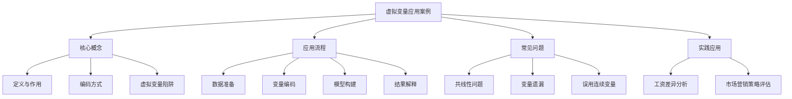

# 虚拟变量应用案例

## 1. 概念解析

### 什么是虚拟变量？

**虚拟变量（Dummy Variable）** 是一种用于表示**分类变量**的数值变量，通常取值为 0 或 1，用于在回归模型中引入**非数值型变量**（如性别、地区、品牌等）。虚拟变量的引入使得回归模型可以处理具有类别属性的解释变量，从而更全面地建模现实问题。

### 虚拟变量在回归分析中的作用与意义

- **将定性变量转化为定量信息**：回归模型要求输入变量为数值型，虚拟变量使得性别、地区等定性变量也能参与建模。
- **捕捉类别之间的差异**：通过虚拟变量，可以分析不同类别对因变量（如销售额、工资、房价等）的影响程度。
- **避免遗漏变量偏差**：忽略分类变量可能导致模型遗漏重要信息，影响预测准确性。

### 虚拟变量陷阱（Dummy Variable Trap）

当分类变量有 $ k $ 个类别时，通常只引入 $ k-1 $ 个虚拟变量以避免**多重共线性**。如果引入全部 $ k $ 个变量，模型会出现完全共线性，无法求解。

---

## 2. 知识结构



---

## 3. 教学应用

### 3.1 真实案例

#### 案例一：工资差异分析（性别与行业）

**场景描述：**
某人力资源部门想分析不同性别和行业对员工工资的影响，数据包括员工的工资、性别（男/女）、所在行业（IT、金融、教育）等信息。

**应用过程：**

1. **变量处理**：
   - 性别：男（1）、女（0）——直接转换为一个虚拟变量；
   - 行业：有3个类别，使用虚拟变量编码，保留2个变量（例如：IT=10，金融=01，教育=00）。

2. **构建回归模型**：
   ```python
   model = smf.ols('工资 ~ 性别 + 行业_IT + 行业_金融', data=df).fit()
   ```

3. **结果解释**：
   - 若性别系数为正且显著，说明男性工资更高；
   - 若行业IT系数显著大于0，说明IT行业工资高于基准行业（教育）。

**价值体现：**
- 能量化性别和行业对工资的影响；
- 有助于制定公平薪酬政策；
- 识别是否存在性别或行业歧视。

---

#### 案例二：市场推广效果评估（广告渠道）

**场景描述：**
某电商公司通过三个广告平台（A、B、C）进行推广，想评估不同平台对销售额的影响。

**应用过程：**

1. **数据准备**：
   - 广告平台（A、B、C），销售额（连续变量）；
   - 构建两个虚拟变量：平台_B、平台_C（平台_A为基准）。

2. **建立回归模型**：
   ```python
   model = smf.ols('销售额 ~ 平台_B + 平台_C', data=df).fit()
   ```

3. **结果解读**：
   - 若平台_B系数显著为正，说明平台B的广告效果优于平台A；
   - 若平台_C系数为负，说明平台C效果不佳。

**价值体现：**
- 帮助企业优化广告投放策略；
- 提供数据支持决策；
- 避免主观判断广告效果。

---

### 3.2 常见误区与辨析

| 误区 | 描述 | 辨析 |
|------|------|------|
| 引入全部虚拟变量 | 对于k个类别，全部引入k个变量 | 会导致多重共线性，应引入k-1个变量 |
| 将分类变量当作连续变量处理 | 直接将类别编号为1、2、3参与建模 | 类别无序时不能用数值大小表示差异，应使用虚拟变量 |
| 忽略虚拟变量的交互作用 | 仅考虑主效应，不考虑变量间的协同效应 | 可引入虚拟变量与连续变量的交互项提升模型解释力 |
| 忽略基准组选择 | 随意选择基准组，导致解释困难 | 基准组应具代表性，便于结果解释（如选择“教育”作为行业基准） |

---

## 4. 学习活动设计

### 活动名称：虚拟变量在房价预测中的应用

#### 活动目标：
掌握虚拟变量在回归模型中的构建与解释方法，提升对分类变量建模的理解与实践能力。

#### 活动内容与步骤：

1. **数据准备（10分钟）**
   - 提供一份房屋数据集，包含以下字段：价格（因变量）、面积（数值型）、装修类型（毛坯、简装、精装）、区域（东、南、西、北）。
   - 学员任务：对装修类型和区域进行虚拟变量编码。

2. **模型构建（15分钟）**
   - 构建多元线性回归模型，包含面积、装修类型（虚拟变量）、区域（虚拟变量）。
   - 使用Python的statsmodels或sklearn实现。

3. **结果分析（15分钟）**
   - 分析回归系数，解释装修类型和区域对房价的影响。
   - 讨论是否出现虚拟变量陷阱，如何避免。

4. **小组讨论（10分钟）**
   - 问题引导：
     - 哪个装修类型对房价提升最大？为什么？
     - 区域变量中，哪个区域是基准组？如何解释其他区域的系数？
     - 如果去掉某个虚拟变量，模型结果会发生什么变化？

#### 所需工具/资源：
- Python环境（Jupyter Notebook）
- 库：pandas, statsmodels, sklearn
- 数据集：模拟房价数据集（包含分类与数值变量）

---

## 5. 评估与反馈

### 形成性评价问题一：

**问题：** 在一个包含4个类别的地区变量中，为什么只应引入3个虚拟变量？

**评估标准：**

- **优秀：** 能准确指出避免多重共线性的原因，并说明若引入全部4个变量会导致模型无法估计。
- **合格：** 知道需要引入k-1个变量，但未能清晰解释原理。
- **待提高：** 仍可能引入全部4个变量，或误以为引入数量不影响模型性能。

---

### 形成性评价问题二：

**问题：** 若一个回归模型中性别变量的系数为+2000且显著，如何解释这个结果？

**评估标准：**

- **优秀：** 能指出在其他变量不变的情况下，性别为1（如男性）的员工平均工资比性别为0（如女性）的员工高2000元。
- **合格：** 能说明性别对工资有影响，但解释不够准确或未指出“控制其他变量”的前提。
- **待提高：** 无法解释系数的实际含义或误认为性别变量是连续变量。

---

### 形成性评价问题三：

**问题：** 在使用虚拟变量进行回归时，若发现某虚拟变量的p值为0.78，应如何处理？

**评估标准：**

- **优秀：** 能指出该变量在统计上不显著，建议删除或合并该类别，并考虑数据是否不足或分类是否合理。
- **合格：** 知道该变量不显著，但处理建议不够具体或未考虑分类问题。
- **待提高：** 仍保留该变量或误以为p值高表示变量重要。