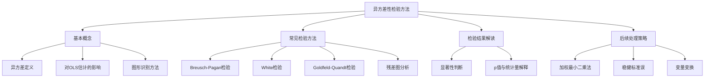

# 知识点名称：异方差性检验方法

---

## 1. 概念解析

### 什么是异方差性检验方法？

在多元线性回归模型中，**异方差性（Heteroskedasticity）** 指的是误差项（残差）的方差随着解释变量的变化而变化，即误差项的方差不是常数。这违背了经典线性回归模型中“同方差性”（Homoskedasticity）的假设，可能导致回归系数的标准误估计有偏，从而影响假设检验的可靠性。

**异方差性检验方法** 是用于判断回归模型是否存在异方差性的统计方法，其核心目标是通过统计检验手段识别模型误差项是否具有非恒定方差，以便采取相应的修正措施。

---

### 异方差性检验的意义与作用

1. **模型诊断**：帮助判断回归模型是否满足经典假设，是模型诊断的重要环节。
2. **提高推断可靠性**：若存在异方差而未处理，回归系数的显著性检验（如t检验、F检验）可能失效，影响结论的可信度。
3. **指导模型修正**：识别异方差后，可采用加权最小二乘法（WLS）、稳健标准误（White标准误）等方法进行修正。
4. **提升预测精度**：修正异方差有助于提升模型的预测稳定性与泛化能力。

---

## 2. 知识结构

---

### 关键子知识点详解

1. **异方差定义**：
   - 误差项的方差随解释变量变化而变化。
   - 通常表现为残差随解释变量增加而“扩散”或“收缩”。

2. **对OLS的影响**：
   - 回归系数估计仍无偏，但标准误估计有偏。
   - 导致t检验和F检验不准确，可能错误拒绝或接受原假设。

3. **图形识别方法**：
   - 绘制残差图（Residual Plot）：观察残差随解释变量变化的趋势。
   - 若残差呈现“喇叭形”或“漏斗形”，可能存在异方差。

4. **常见检验方法**：

| 检验方法 | 原理 | 特点 |
|----------|------|------|
| Breusch-Pagan检验 | 构建辅助回归模型，检验误差方差是否与解释变量相关 | 适用于线性关系，需假设误差服从正态分布 |
| White检验 | 构建包含解释变量及其平方项和交互项的辅助回归 | 无需正态假设，适用性强，但自由度消耗大 |
| Goldfeld-Quandt检验 | 将样本按解释变量排序后分为两部分，比较两部分的残差方差 | 适用于单变量模型，需明确排序变量 |

5. **检验结果解读**：
   - 若p值小于显著性水平（如0.05），拒绝“同方差”原假设，认为存在异方差。
   - 若p值较大，则不能拒绝同方差假设。

6. **后续处理策略**：
   - 使用**稳健标准误**（如White标准误）进行假设检验。
   - 使用**加权最小二乘法**（WLS）重新估计模型。
   - 对因变量或解释变量进行**变量变换**（如取对数）。

---

## 3. 教学应用

### 3.1 真实案例

#### 案例一：居民收入与消费支出的关系分析（经济学）

- **场景描述**：研究居民收入（X）与消费支出（Y）之间的关系，构建线性回归模型 Y = β₀ + β₁X + ε。
- **问题背景**：高收入人群的消费波动较大，可能导致误差项随收入增加而增大。
- **检验过程**：
  - 绘制残差图，发现残差呈现“喇叭形”分布。
  - 使用White检验，p值为0.01，拒绝同方差假设。
- **处理方法**：
  - 使用稳健标准误重新进行显著性检验。
  - 或者对收入和消费取对数，再建模以缓解异方差性。

#### 案例二：企业销售额与广告投入的关系建模（市场营销）

- **场景描述**：分析广告投入（X）对企业销售额（Y）的影响。
- **问题背景**：广告投入越大，销售额波动越大，残差方差可能随广告投入增加而增加。
- **检验过程**：
  - 使用Breusch-Pagan检验，p值为0.03，表明存在异方差。
- **处理方法**：
  - 使用加权最小二乘法（WLS），权重设为1/广告投入，以降低高广告投入样本的权重。

---

### 3.2 常见误区与辨析

| 误区 | 辨析 |
|------|------|
| **只关注R²而忽略异方差问题** | R²反映模型拟合优度，但无法说明模型是否满足经典假设。即使R²高，若存在异方差，t检验结果仍可能不可靠。 |
| **误认为异方差会改变回归系数估计值** | 异方差不会导致回归系数有偏，但会影响标准误估计，从而影响显著性检验。 |
| **仅用残差图判断异方差而不进行统计检验** | 图形判断主观性强，建议结合统计检验（如White或BP检验）进行判断。 |
| **误用检验方法** | Goldfeld-Quandt适用于单变量模型，White检验适用于多变量模型但自由度消耗大，应根据模型结构选择合适方法。 |

---

## 4. 学习活动设计

### 活动名称：异方差性检验与修正实战演练

#### 活动目标：

- 掌握异方差性检验的基本流程。
- 能够使用统计软件（如Stata、R或Python）进行异方差性检验与修正。
- 理解异方差对回归结果的影响及应对策略。

#### 活动内容与步骤：

1. **数据导入与初步建模**（10分钟）
   - 提供一份“居民收入与消费支出”数据集（含收入、消费、年龄、教育程度等变量）。
   - 使用Python或R建立线性回归模型：`消费支出 = β₀ + β₁收入 + β₂年龄 + β₃教育程度 + ε`。

2. **异方差性识别**（15分钟）
   - 绘制残差图，观察是否呈现“喇叭形”。
   - 进行White检验和Breusch-Pagan检验，记录p值。

3. **结果解读与讨论**（10分钟）
   - 判断是否存在异方差。
   - 讨论如果存在异方差，应如何修正模型。

4. **模型修正与比较**（15分钟）
   - 使用稳健标准误（White标准误）重新估计模型。
   - 或者使用加权最小二乘法（WLS）进行修正。
   - 比较原始模型与修正模型的系数标准误和显著性结果。

5. **小组汇报与总结**（10分钟）
   - 各组汇报检验结果与修正方法。
   - 教师点评并总结异方差性检验与修正的关键点。

#### 所需工具/资源：

- Python（pandas、statsmodels、matplotlib）
- 或 R（lmtest、sandwich、ggplot2）
- 示例数据集（如“income_consumption.csv”）

---

## 5. 评估与反馈

### 形成性评价问题与标准

1. **问题一：异方差性对回归模型的影响是什么？**
   - **评估标准**：
     - **优秀**：能准确说明异方差不会影响回归系数估计，但会导致标准误偏误，进而影响t检验和F检验的可靠性。
     - **合格**：能指出异方差影响模型的显著性检验，但未准确说明具体影响。
     - **待提高**：认为异方差会影响回归系数本身，或完全不了解其影响。

2. **问题二：如何判断一个回归模型是否存在异方差？**
   - **评估标准**：
     - **优秀**：能列举图形方法（如残差图）和统计检验方法（如White、BP、Goldfeld-Quandt检验），并说明各方法适用场景。
     - **合格**：知道可以通过残差图或统计检验判断，但未能准确描述方法。
     - **待提高**：仅凭R²或F检验判断是否存在异方差。

3. **问题三：如果发现模型存在异方差，你会采取哪些措施？**
   - **评估标准**：
     - **优秀**：能提出使用稳健标准误、加权最小二乘法、变量变换等至少两种方法，并能说明其原理。
     - **合格**：能提出一种修正方法，但解释不够深入。
     - **待提高**：不知道如何处理异方差或提出错误方法（如直接删除变量）。

--- 

**教学建议**：在讲解过程中建议使用可视化工具辅助讲解残差图和检验结果，帮助学员建立直观理解；同时结合实际数据操作，增强动手能力与问题诊断能力。