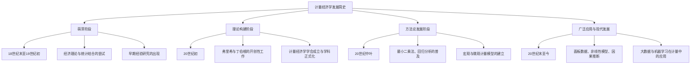

# 计量经济学发展简史

---

## 1. 概念解析

### 什么是“计量经济学发展简史”？

“计量经济学发展简史”是指从计量经济学诞生以来，其理论体系、方法论、应用领域等方面演变和发展的历史过程。它是理解计量经济学为何存在、如何演进、以及为何采用当前研究方法的重要基础。

### 核心概念与意义

- **计量经济学的定义回顾**：计量经济学是将经济理论、数学方法与统计学结合，通过实证分析来验证经济理论、预测经济变量变化、制定政策建议的一门交叉学科。

- **发展简史的核心作用**：
  - **理解方法论来源**：了解计量经济学的发展路径，有助于理解当前主流方法（如OLS、时间序列分析、面板数据模型等）的形成背景。
  - **认识学科演变逻辑**：从古典到现代，计量经济学经历了从理论驱动到数据驱动的转变，反映了经济学研究范式的演进。
  - **增强理论与实践联系**：通过历史视角，学员可以更清晰地看到计量经济学如何服务于政策制定、市场预测、经济分析等实际问题。

---

## 2. 知识结构

### 计量经济学发展简史的知识体系可分为以下几个关键阶段：

### 关键子知识点详解：

1. **萌芽阶段（18世纪末至19世纪初）**
   - 经济学与统计学初步结合，例如恩格尔定律、格雷欣法则的经验验证。
   - 主要表现为对经济现象的观察与初步量化分析。

2. **理论构建阶段（20世纪初）**
   - 挪威经济学家拉格纳·弗里希（Ragnar Frisch）和荷兰经济学家扬·丁伯根（Jan Tinbergen）被认为是计量经济学的奠基人。
   - 1930年，国际计量经济学会（Econometric Society）成立，标志着该学科的正式诞生。

3. **方法论发展阶段（20世纪中叶）**
   - 普遍采用最小二乘法（OLS）、回归分析、联立方程模型等工具。
   - 代表人物：特里夫·科普曼斯（Tjalling Koopmans）、劳伦斯·克莱因（Lawrence Klein）。
   - 建立了宏观与微观经济模型的基础框架。

4. **广泛应用与现代发展（20世纪末至今）**
   - 面板数据分析、时间序列模型（如VAR、GARCH）、非参数方法兴起。
   - 强调因果识别（如双重差分DID、工具变量IV、断点回归RDD）。
   - 大数据与机器学习开始融合，推动了“计算计量经济学”的发展。

---

## 3. 教学应用

### 3.1 真实案例

#### 案例一：宏观经济预测模型的建立（1950年代）

- **背景**：二战后，各国政府需要科学预测经济走势，制定财政与货币政策。
- **应用过程**：
  - 丁伯根与克莱因等人构建了最早的宏观经济计量模型。
  - 使用回归分析估计消费、投资、出口等关键变量之间的关系。
  - 模型被用于预测GDP、就业率等宏观经济指标。
- **价值体现**：这是计量经济学首次大规模应用于国家政策制定，推动了计量经济学在政府决策中的地位确立。

#### 案例二：教育回报率研究（现代微观计量）

- **背景**：如何评估教育对个人收入的影响？
- **应用过程**：
  - 使用面板数据与工具变量法（IV）解决“能力偏差”问题。
  - 构建收入方程，估计教育年限对工资的影响。
  - 研究结果被用于制定教育政策与补贴计划。
- **价值体现**：展示了计量经济学在微观个体行为分析中的应用，推动了劳动经济学的发展。

### 3.2 常见误区与辨析

1. **误区一：计量经济学只是统计学的简单应用**
   - **辨析**：计量经济学不仅仅是统计技术的应用，更重要的是它将经济理论作为建模基础。例如，模型设定、变量选择、因果识别等都依赖经济理论指导。

2. **误区二：计量经济学的发展只集中在欧美国家**
   - **辨析**：虽然计量经济学起源于欧美，但近年来在亚洲、非洲、拉丁美洲等地区也有广泛应用。例如，中国学者在面板数据与结构方程建模方面也有重要贡献。

3. **误区三：计量经济学只能用于宏观分析**
   - **辨析**：现代计量经济学广泛应用于微观领域，如劳动经济学、健康经济学、教育经济学等，因果推断方法（如DID、RDD）多用于微观数据研究。

4. **误区四：计量经济学的发展与计算机技术无关**
   - **辨析**：计算机技术的发展极大地推动了计量经济学的应用，例如面板数据处理、大规模模拟、非参数估计等都依赖计算能力。

---

## 4. 学习活动设计

### 活动名称：**“时间线拼图”——计量经济学发展简史小组活动**

#### 活动目标：

- 巩固学生对计量经济学发展脉络的理解。
- 提高学生对关键人物、方法、应用领域的识别与联系能力。

#### 活动内容与步骤：

1. **准备阶段（10分钟）**
   - 教师提供10-15张卡片，每张卡片包含一个关键事件、人物、方法或应用领域（如“1930年计量经济学学会成立”、“弗里希提出经济计量模型”、“面板数据分析兴起”等）。
   - 卡片内容按时间顺序打乱。

2. **小组任务（20分钟）**
   - 学生分组（3-4人一组），将卡片按时间顺序排列，并简要解释每个事件的意义。
   - 每组需在图表或白板上绘制时间线，并标注关键节点。

3. **展示与讨论（15分钟）**
   - 每组展示其时间线图。
   - 教师引导讨论以下问题：
     - 哪些事件对计量经济学的发展影响最大？
     - 为什么某些方法（如面板数据）在20世纪末才广泛使用？
     - 当前发展趋势是否与你预期一致？

#### 所需资源：

- 时间卡片（打印或电子形式）
- 白板或大张纸、记号笔
- 投影仪或展示工具

---

## 5. 评估与反馈

### 形成性评价问题：

1. **问题一**：请简要说明计量经济学发展的几个主要阶段及其代表性成果。
   - **评估标准**：
     - 优秀：能清晰划分阶段，并准确列举代表性人物、方法、事件。
     - 合格：能识别主要阶段，但对细节描述不够准确。
     - 待提高：混淆发展阶段或无法识别关键节点。

2. **问题二**：为什么说弗里希和丁伯根是计量经济学的奠基人？
   - **评估标准**：
     - 优秀：能说明他们首次系统化地将经济理论、数学与统计结合，并推动学科制度化。
     - 合格：知道他们是计量经济学创始人，但对贡献描述不具体。
     - 待提高：不清楚其历史地位或误认为是其他学者。

3. **问题三**：现代计量经济学与早期相比有哪些显著变化？
   - **评估标准**：
     - 优秀：能指出从宏观建模到微观因果识别、从理论驱动到数据驱动、从传统统计到计算方法等转变。
     - 合格：能列举部分变化，但逻辑不清晰或遗漏重点。
     - 待提高：仅能模糊描述变化，或误认为方法未发生重大演变。

---