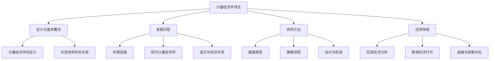

# 知识点名称：计量经济学导论

---

## 1. 概念解析

### 什么是计量经济学？

**计量经济学**（Econometrics）是经济学与统计学、数学相结合的一门学科，旨在通过定量方法对经济理论进行实证检验，并基于实际数据进行预测与政策分析。

### 核心概念与意义：

- **经济理论的验证**：通过数据验证经济学理论是否成立，例如“价格上升是否导致需求下降”。
- **数量关系建模**：使用数学模型（如线性回归模型）描述变量之间的关系。
- **统计推断与预测**：利用统计方法从样本数据中推断总体特征，并对未来趋势进行预测。
- **政策评估与决策支持**：为政府、企业等提供基于数据的决策依据，如评估税收政策对消费的影响。

### 在经济学领域中的作用：

- **桥梁作用**：连接抽象的经济理论与现实世界的数据。
- **提升决策科学性**：通过数据分析支持经济政策制定和企业管理。
- **推动学术研究**：为经济学研究提供严谨的实证方法论基础。

---

## 2. 知识结构

### 计量经济学导论的知识体系：

### 关键子知识点详解：

1. **定义与基本概念**
   - 包括计量经济学的基本定义、目标与任务。
   - 与其他学科（如统计学、数理经济学）的关系。

2. **发展历程**
   - 从20世纪初的萌芽到现代的发展。
   - 关键人物与里程碑事件（如弗里希、丁伯根、克莱因等）。

3. **研究方法**
   - 数据类型：时间序列、横截面、面板数据。
   - 建模流程：设定模型 → 数据收集 → 参数估计 → 模型检验 → 应用预测。
   - 常用方法：最小二乘法、最大似然估计、假设检验等。

4. **应用领域**
   - 宏观经济预测（如GDP增长、通货膨胀率）。
   - 消费者行为分析、企业决策建模。
   - 政策评估（如最低工资政策对就业的影响）。

---

## 3. 教学应用

### 3.1 真实案例

#### 案例一：**最低工资政策对就业率的影响分析**

- **场景描述**：政府提高最低工资标准，是否会导致企业减少雇佣？

- **应用过程**：
  1. **设定模型**：构建一个包含最低工资、就业率、地区经济状况等因素的回归模型。
  2. **数据收集**：使用不同地区或国家的面板数据。
  3. **参数估计**：采用OLS（普通最小二乘法）进行估计。
  4. **结果分析**：判断最低工资变化是否对就业率有显著负面影响。

- **价值体现**：帮助政府制定更科学的劳动政策，平衡劳动者权益与就业市场稳定。

---

#### 案例二：**消费者价格弹性分析**

- **场景描述**：某品牌想了解其产品价格变动对销量的影响。

- **应用过程**：
  1. **数据收集**：收集过去一年的价格与销量数据。
  2. **构建模型**：使用对数线性模型来估计价格弹性。
  3. **参数估计与解释**：得出价格每上升1%，销量下降的百分比。
  4. **决策支持**：帮助企业制定最优定价策略。

- **价值体现**：为市场营销和价格策略提供数据支持。

---

### 3.2 常见误区与辨析

| 误区编号 | 常见误解 | 辨析说明 |
|----------|----------|-----------|
| 1 | 计量经济学就是用统计软件做回归 | 实际上，计量经济学强调模型设定、理论依据和结果解释，软件只是工具 |
| 2 | 只要有数据就能做计量分析 | 数据质量、代表性、因果关系等是建模的前提，否则会导致“伪回归” |
| 3 | 回归系数显著就代表因果关系 | 显著性仅说明统计关联，因果推断需要满足严格的识别条件（如工具变量法） |
| 4 | 所有变量都放进模型更好 | 变量过多可能导致多重共线性、过拟合等问题，应基于理论和统计方法筛选 |

---

## 4. 学习活动设计

### 活动名称：**“我的第一个计量模型”模拟练习**

#### 活动目标：
帮助学员理解计量经济学建模的基本流程，掌握变量选择、模型设定与初步分析能力。

#### 活动内容与步骤：

1. **背景设定（5分钟）**  
   - 场景：某城市计划提高公共交通票价，希望了解票价变化对乘客数量的影响。

2. **小组任务（30分钟）**  
   - 每组（3-4人）根据以下数据设计一个计量模型：
     - 因变量：乘客数量（人次/日）
     - 自变量：票价、天气、节假日、周边交通状况
   - 要求：
     1. 选择合适的函数形式（线性、对数等）
     2. 说明变量选取的理论依据
     3. 列出模型表达式并解释参数含义

3. **展示与互评（15分钟）**  
   - 每组派代表展示模型设定，其他组提问或提出改进建议。

4. **教师总结（10分钟）**  
   - 强调模型设定的逻辑性与数据匹配性，指出常见问题（如遗漏变量、错误函数形式）。

#### 所需工具/资源：
- 白板或PPT
- 数据样例表（可虚构）
- Excel或Stata基础操作指导（可选）

---

## 5. 评估与反馈

### 形成性评价问题一：
**什么是计量经济学？它与统计学、数理经济学有何区别？**

- **评估标准**：
  - **优秀**：能准确区分三者，指出计量经济学强调“理论+数据+方法”的结合。
  - **合格**：能描述计量经济学的定义，但对区别理解不够清晰。
  - **待提高**：混淆计量经济学与其他学科，无法说明其独特性。

---

### 形成性评价问题二：
**在构建计量模型时，为什么要选择合适的变量？列举可能的问题。**

- **评估标准**：
  - **优秀**：能指出变量选择影响模型解释力与预测准确性，列举如遗漏变量偏差、多重共线性等问题。
  - **合格**：知道变量选择重要，但无法具体说明问题。
  - **待提高**：认为变量越多越好，缺乏筛选意识。

---

### 形成性评价问题三：
**请解释“伪回归”现象及其可能原因。**

- **评估标准**：
  - **优秀**：能说明伪回归是指统计显著但无实际因果关系的现象，常见于非平稳时间序列或数据结构不合理。
  - **合格**：知道伪回归是虚假关系，但对成因理解模糊。
  - **待提高**：不了解伪回归的概念或误认为是模型计算错误。

--- 

> **教学建议**：  
> 本节课内容为入门基础，建议结合实际生活中的经济现象进行引导式教学，增强学员兴趣与理解力。后续可逐步引入回归分析、假设检验等进阶内容。