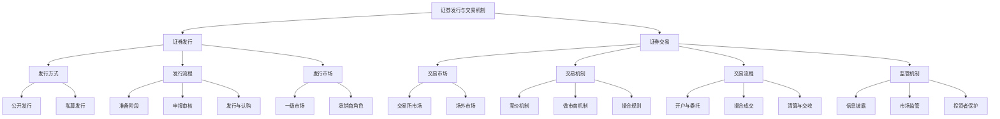

# 知识点名称：证券发行与交易机制

---

## 1. 概念解析

**证券发行与交易机制**是指证券从发行到流通的全过程，涵盖证券的发行方式、发行流程、交易市场结构、交易机制以及监管体系等内容。它是证券市场运行的基础，决定了证券如何从发行人（如企业或政府）流向投资者，并在二级市场上进行流通与转让。

### 核心概念与意义：

- **证券发行**：指发行人通过特定程序向投资者出售证券（如股票、债券）以筹集资金的过程。它是企业融资的重要手段，也是资本市场资源配置的核心机制。
  
- **证券交易**：指证券在投资者之间进行买卖的过程，主要发生在证券交易所（如沪深交易所、纽约证券交易所）或场外市场（OTC）。

- **一级市场与二级市场**：
  - **一级市场**：新证券首次发行的市场，主要功能是融资。
  - **二级市场**：已发行证券的流通市场，主要功能是提供流动性。

- **做市商机制与竞价机制**：
  - 做市商机制：由专门的做市商提供买卖报价，维持市场流动性。
  - 竞价机制：投资者通过买卖订单撮合成交，常见于股票交易所。

- **监管机制**：包括证监会等监管机构对发行与交易行为的规范，确保市场公平、透明、有序。

**意义与作用**：
- 为企业和政府提供融资渠道；
- 为投资者提供投资与退出机制；
- 促进资本的有效配置与价格发现；
- 构建稳定、透明、高效的金融市场体系。

---

## 2. 知识结构

---

## 3. 教学应用

### 3.1 真实案例

#### 案例一：**某科技公司首次公开发行（IPO）**

- **场景描述**：一家初创科技公司计划通过IPO融资10亿元人民币，在上海证券交易所上市。
- **应用过程**：
  1. 公司聘请投行作为主承销商，协助准备招股说明书；
  2. 向证监会提交发行申请并接受审核；
  3. 通过路演向机构投资者推介股票；
  4. 确定发行价格后，向公众投资者公开发行股票；
  5. 股票上市后在二级市场流通，投资者可自由买卖。
- **价值体现**：通过IPO机制，公司获得发展所需资金，同时为投资者提供了投资机会，体现了证券发行机制在资源配置中的作用。

#### 案例二：**投资者通过证券账户买卖股票**

- **场景描述**：个人投资者通过证券公司账户，在深交所买入某上市公司股票。
- **应用过程**：
  1. 投资者开户并绑定资金账户；
  2. 下达买入委托，系统撮合成交；
  3. 成交后，系统完成清算与交收；
  4. 投资者可在任意交易日卖出股票。
- **价值体现**：证券交易机制保障了投资者的流动性需求，体现了二级市场的核心功能。

---

### 3.2 常见误区与辨析

| 误区 | 辨析 |
|------|------|
| **误区一：一级市场与二级市场没有区别** | 一级市场是新证券发行的市场，功能是融资；二级市场是已发行证券的流通市场，功能是提供流动性。两者在市场功能、参与者、监管重点等方面均有差异。 |
| **误区二：所有证券交易都必须在交易所进行** | 实际上，证券交易还包括场外交易（OTC），如债券回购、私募股权交易等。交易所市场更规范透明，而OTC市场更灵活。 |
| **误区三：做市商和竞价机制是完全对立的** | 两者是不同交易机制，适用于不同市场。例如，科创板引入做市商机制，与竞价机制并存，提升流动性。理解其互补性有助于全面认识交易机制。 |
| **误区四：证券交易撮合是随机的** | 实际上，撮合遵循“价格优先、时间优先”原则，系统自动匹配最优买卖订单，确保交易公平与效率。 |

---

## 4. 学习活动设计

### 活动名称：模拟证券发行与交易流程

### 活动目标：
帮助学员理解证券发行与交易机制的全过程，掌握关键流程和操作要点，提升对交易机制的实际操作能力。

### 活动内容与步骤：

1. **角色分配**（10分钟）
   - 学员分组，每组扮演不同角色：发行人、承销商、投资者、交易所、监管机构。

2. **模拟发行流程**（20分钟）
   - 发行人准备材料、提交申请；
   - 承销商协助路演、定价；
   - 监管机构审核并批准；
   - 完成发行并上市。

3. **模拟交易流程**（20分钟）
   - 投资者开户、委托买卖；
   - 交易所撮合成交；
   - 清算与交收操作。

4. **小组讨论与汇报**（20分钟）
   - 各组总结角色在流程中的作用；
   - 分析流程中可能遇到的问题及解决办法；
   - 教师点评与总结。

### 所需工具/资源：
- 模拟交易平台（如模拟炒股软件或Excel流程图）；
- 角色任务说明书；
- 讨论问题清单。

---

## 5. 评估与反馈

### 形成性评价问题一：
**请简述证券发行的一级市场与二级市场的区别及其各自的功能。**

- **评估标准**：
  - **优秀**：能准确区分一级市场（融资）与二级市场（流通），并说明其在证券市场中的具体作用。
  - **合格**：能识别两者基本区别，但功能描述不够清晰。
  - **待提高**：混淆一级与二级市场定义，或无法说明其功能。

---

### 形成性评价问题二：
**证券交易中的“价格优先、时间优先”原则是如何体现的？举例说明。**

- **评估标准**：
  - **优秀**：能准确解释该原则含义，并结合实例（如买单高于卖单价优先成交）说明其在撮合系统中的应用。
  - **合格**：理解原则含义，但举例不具体或逻辑不清晰。
  - **待提高**：不能正确理解“价格优先、时间优先”的含义。

---

### 形成性评价问题三：
**如果某只股票在交易所实行做市商机制，你认为它与竞价机制相比有哪些优势和劣势？**

- **评估标准**：
  - **优秀**：能指出做市商机制在流动性、价格稳定方面的优势，以及可能带来的信息不对称问题。
  - **合格**：能识别机制差异，但分析不够深入。
  - **待提高**：无法区分做市商机制与竞价机制，或理解错误。

--- 

> **教学提示**：建议在教学中结合实际市场数据、新闻事件（如IPO案例、做市商制度试点）进行讲解，增强学员对知识点的理解与兴趣。