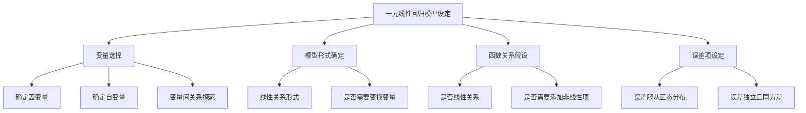

# 一元线性回归模型设定

## 1. 概念解析

### 1.1 什么是一元线性回归模型设定？

**一元线性回归模型设定**是指在构建一元线性回归模型时，明确变量之间的关系形式、变量选取以及模型表达式的过程。其核心目标是建立一个能够准确描述**一个自变量（解释变量）与一个因变量（响应变量）之间线性关系**的数学模型。

模型的基本形式为：

$$
Y = \beta_0 + \beta_1 X + \varepsilon
$$

其中：

- $ Y $：因变量（响应变量）
- $ X $：自变量（解释变量）
- $ \beta_0 $：截距项，表示当 $ X = 0 $ 时 $ Y $ 的期望值
- $ \beta_1 $：斜率项，表示 $ X $ 每变化一个单位时 $ Y $ 的平均变化量
- $ \varepsilon $：误差项，表示模型未能解释的随机扰动或测量误差

### 1.2 模型设定的意义与作用

- **揭示变量关系**：通过模型设定，可以明确自变量与因变量之间的线性关系是否成立。
- **指导变量选择**：设定过程有助于识别哪些变量是关键的解释变量，避免引入无关变量或遗漏重要变量。
- **提高预测精度**：合理的模型设定是后续参数估计和预测准确性的基础。
- **支持因果推断**：在满足一定假设条件下，模型设定有助于进行变量间的因果关系分析。

---

## 2. 知识结构

### 2.1 知识体系图示

### 2.2 关键子知识点详解

1. **变量选择**：
   - 明确研究目的，选择与因变量有理论或经验支持的自变量。
   - 排除与因变量无关或相关性极低的变量。

2. **模型形式确定**：
   - 确定是否使用线性形式，必要时可引入变量变换（如对数变换）或非线性项。
   - 检查变量间是否存在非线性趋势，如通过散点图或相关系数分析。

3. **函数关系假设**：
   - 假设自变量与因变量之间存在线性关系。
   - 若关系非线性，可能需要引入多项式项或使用其他模型。

4. **误差项设定**：
   - 假设误差项服从正态分布。
   - 假设误差项之间相互独立且具有相同方差（同方差性）。

---

## 3. 教学应用

### 3.1 真实案例

#### 案例一：销售预测

- **场景描述**：某公司希望通过广告投入（自变量）来预测产品销售额（因变量）。
- **模型设定**：
  - 因变量 $ Y $：销售额
  - 自变量 $ X $：广告费用
  - 模型设定为：$ \text{销售额} = \beta_0 + \beta_1 \times \text{广告费用} + \varepsilon $
- **价值体现**：
  - 通过模型设定，公司可以量化广告投入对销售额的影响。
  - 预测不同广告预算下的销售额，辅助制定营销策略。

#### 案例二：教育成绩分析

- **场景描述**：研究学生学习时间与考试成绩之间的关系。
- **模型设定**：
  - 因变量 $ Y $：考试成绩
  - 自变量 $ X $：每周学习时间
  - 模型设定为：$ \text{成绩} = \beta_0 + \beta_1 \times \text{学习时间} + \varepsilon $
- **价值体现**：
  - 量化学习时间对成绩的影响，帮助学生合理安排学习计划。
  - 教育机构可据此评估教学效果。

---

### 3.2 常见误区与辨析

| 误区 | 辨析 |
|------|------|
| 误认为只要变量相关就可以建立线性模型 | 线性回归要求变量间存在**线性关系**，即使相关性高，若为非线性关系（如指数、对数），仍需调整模型形式 |
| 忽略变量选择，盲目加入多个变量 | 一元线性回归只应包含一个自变量，加入多个变量将变成多元回归，需重新设定模型 |
| 忽视误差项的正态性和独立性假设 | 若误差项不符合这些假设，参数估计可能不准确，需进行模型修正或使用其他方法 |
| 直接使用原始数据，不进行变量变换 | 若变量之间存在非线性趋势，应考虑对变量进行变换（如取对数）以满足线性假设 |

---

## 4. 学习活动设计

### 活动名称：模拟销售预测建模

#### 活动目标：
帮助学员理解并实践一元线性回归模型设定的过程，掌握变量选择、模型形式判断与误差项设定的基本方法。

#### 活动内容与步骤：

1. **数据导入与探索**（10分钟）
   - 提供一份模拟销售数据集，包含广告投入和销售额两列数据。
   - 使用散点图观察变量间关系，判断是否存在线性趋势。

2. **模型设定练习**（15分钟）
   - 学员根据数据特征设定回归模型形式。
   - 讨论是否需要对变量进行变换（如对广告费用取对数）。

3. **模型构建与误差分析**（15分钟）
   - 使用统计软件（如Python的`statsmodels`或Excel）构建模型。
   - 分析残差图，判断误差项是否满足正态性和独立性假设。

4. **小组汇报与讨论**（10分钟）
   - 每组汇报模型设定过程、遇到的问题及解决方案。
   - 教师点评并总结模型设定的关键点。

#### 所需工具/资源：
- 数据集（Excel或CSV格式）
- Python环境（可选）：`pandas`, `matplotlib`, `statsmodels`
- 教学PPT或白板

---

## 5. 评估与反馈

### 形成性评价问题一：
**问题**：在设定一元线性回归模型时，为什么需要对变量之间的关系进行可视化分析？

- **评估标准**：
  - 优秀：能说明可视化有助于判断线性关系是否存在，识别异常值，决定是否需要变量变换。
  - 合格：能提到可视化用于观察变量趋势，但未提及具体用途。
  - 待提高：不了解可视化在模型设定中的作用。

---

### 形成性评价问题二：
**问题**：如果发现残差图中存在明显的非随机模式（如曲线趋势），说明模型可能存在什么问题？应如何调整？

- **评估标准**：
  - 优秀：能指出模型可能存在非线性关系或变量设定错误，并提出引入非线性项或变量变换的建议。
  - 合格：能识别出模型设定可能存在问题，但无法提出具体改进措施。
  - 待提高：认为残差图无意义或无法解释其含义。

---

### 形成性评价问题三：
**问题**：在设定模型时，如果选择了一个与因变量无关的自变量，会对模型产生什么影响？

- **评估标准**：
  - 优秀：能指出会导致模型解释力下降、参数估计不稳定、增加过拟合风险等问题。
  - 合格：能意识到无关变量会影响模型，但描述不够具体。
  - 待提高：认为变量选择不影响模型结果。