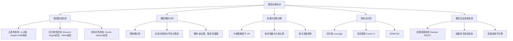

# 知识点名称：模型诊断技术

---

## 1. 概念解析

**模型诊断技术**是多元线性回归建模过程中的关键环节，用于评估模型是否符合基本假设、是否存在模型设定误差，并识别可能影响模型性能的问题，如多重共线性、异方差性、自相关性、非正态性、异常值、杠杆点等。

### 核心概念与意义

- **模型诊断的目的**：确保模型具备良好的统计性质，使得参数估计无偏、有效，预测结果可靠。
- **核心假设回顾**：多元线性回归模型的有效性依赖于以下经典假设：
  1. **线性关系**：因变量与自变量之间存在线性关系。
  2. **正态性**：误差项服从正态分布。
  3. **同方差性（Homoscedasticity）**：误差项的方差恒定。
  4. **无自相关性（No Autocorrelation）**：误差项之间相互独立。
  5. **无多重共线性（Multicollinearity）**：自变量之间不存在高度相关性。
  6. **模型设定正确性**：变量选择合理，函数形式正确。

### 在多元线性回归中的作用

- **识别模型问题**：通过诊断发现模型是否存在违反基本假设的情况。
- **指导模型改进**：为后续模型修正提供依据，如变量选择、变换、引入交互项等。
- **提升模型可靠性**：确保回归结果具备统计显著性和预测能力。

---

## 2. 知识结构

---

## 3. 教学应用

### 3.1 真实案例

#### 案例一：房地产价格预测（经济领域）

- **场景描述**：建立一个多元回归模型，使用面积、楼层数、装修水平、地理位置等变量预测房价。
- **应用过程**：
  1. 建立初步回归模型；
  2. 使用残差图、Q-Q图和Shapiro-Wilk检验检查正态性；
  3. 利用Breusch-Pagan检验判断是否存在异方差；
  4. 计算VIF值检测多重共线性；
  5. 绘制库克距离图识别影响点；
  6. 使用Ramsey RESET检验判断是否存在模型设定误差。
- **价值体现**：通过诊断发现“装修水平”与其他变量存在高度共线性，剔除后模型稳定性提升；残差分析发现存在异方差，采用加权最小二乘法（WLS）修正后，模型预测精度提高。

#### 案例二：消费行为分析（市场营销）

- **场景描述**：研究消费者收入、年龄、教育程度等变量对消费支出的影响。
- **应用过程**：
  1. 建模后发现R²较高但F检验不显著；
  2. 诊断发现存在多重共线性（VIF > 10）；
  3. 使用主成分分析降维后重新建模，F检验显著；
  4. 残差图显示存在非线性趋势，引入变量平方项后模型拟合更好。
- **价值体现**：通过模型诊断识别出多重共线性与非线性问题，提升模型解释力与预测能力。

---

### 3.2 常见误区与辨析

| 误区编号 | 误区描述 | 辨析方法 |
|----------|----------|----------|
| 1 | R²高说明模型一定好 | R²仅反映解释变量对因变量的变异解释比例，不能反映模型是否满足基本假设，需结合残差分析与诊断检验 |
| 2 | 只关注p值，忽略模型假设 | 显著的p值不代表模型无误，若存在异方差或多重共线性，参数估计仍可能不可靠 |
| 3 | 忽略影响点的作用 | 单个异常点可能导致模型参数估计偏移，应使用库克距离或DFBETAS识别并评估其影响 |
| 4 | 诊断工具使用不当 | 如误用Durbin-Watson检验于截面数据，或误用VIF于定性变量，应根据数据类型选择合适方法 |

---

## 4. 学习活动设计

### 活动名称：诊断你的回归模型

#### 活动目标：

- 巩固学员对模型诊断技术的理解；
- 提升诊断工具的应用能力；
- 培养识别与修复模型问题的能力。

#### 活动内容与步骤：

1. **数据准备（10分钟）**
   - 提供一份公开数据集（如波士顿房价数据集）；
   - 学员使用Python或R进行数据加载与初步探索。

2. **建立回归模型（10分钟）**
   - 使用面积、房间数、犯罪率等变量预测房价；
   - 输出回归系数与R²、F检验结果。

3. **模型诊断（20分钟）**
   - 绘制Q-Q图、残差图；
   - 进行正态性、异方差、自相关检验；
   - 计算VIF值，识别多重共线性；
   - 使用库克距离识别影响点。

4. **问题分析与讨论（20分钟）**
   - 小组讨论以下问题：
     - 是否存在模型设定误差？
     - 哪些变量之间存在共线性？如何处理？
     - 是否存在异常点？是否需要剔除？
   - 每组汇报诊断结果与改进建议。

#### 所需工具/资源：

- Python或R语言环境（Jupyter Notebook或RStudio）
- 相关库：`statsmodels`, `scikit-learn`, `car`, `ggplot2`
- 数据集：波士顿房价数据集（`sklearn.datasets.load_boston()`）

---

## 5. 评估与反馈

### 评价问题一：请解释模型诊断中“库克距离”的作用及其判断标准。

- **评估标准**：
  - **优秀**：能准确说明库克距离衡量的是某个观测对整体回归结果的影响，一般认为当Cook's D > 1 或超过4/n时为影响点。
  - **合格**：能说明库克距离用于识别影响点，但判断标准模糊。
  - **待提高**：不了解库克距离的用途或判断标准错误。

### 评价问题二：如果模型的残差图显示“漏斗形”，说明存在什么问题？应如何处理？

- **评估标准**：
  - **优秀**：能指出存在异方差性，并提出处理方法如加权最小二乘法、变量变换等。
  - **合格**：能识别异方差性，但处理方法不完整或不具体。
  - **待提高**：无法识别异方差性或处理方法错误。

### 评价问题三：什么是Ramsey RESET检验？其用于检测哪类模型问题？

- **评估标准**：
  - **优秀**：能准确说明RESET检验用于检测模型是否遗漏了非线性项或变量，属于模型设定误差的一种检测方法。
  - **合格**：能指出RESET检验用于模型设定，但对其检测内容描述不清晰。
  - **待提高**：完全不了解RESET检验或用途错误。

--- 

**教学建议**：鼓励学员结合实际案例进行诊断练习，强调“诊断-分析-修正”闭环思维，提升其在实际建模中识别与修复模型问题的能力。