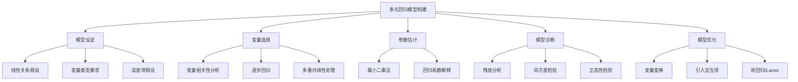

# 知识点名称：多元回归模型构建

---

## 1. 概念解析

**多元线性回归模型**（Multiple Linear Regression, MLR）是一种统计分析方法，用于研究一个**因变量**（目标变量）与多个**自变量**（解释变量）之间的线性关系。其基本形式为：

$$
Y = \beta_0 + \beta_1 X_1 + \beta_2 X_2 + \cdots + \beta_p X_p + \varepsilon
$$

其中：
- $ Y $：因变量（连续型）
- $ X_1, X_2, ..., X_p $：多个自变量
- $ \beta_0 $：截距项
- $ \beta_1, ..., \beta_p $：回归系数
- $ \varepsilon $：误差项，通常假设服从均值为0的正态分布

### 核心意义与作用

- **预测与解释**：通过多个变量预测目标变量，并解释每个变量对结果的影响。
- **变量筛选与建模优化**：帮助识别哪些变量对模型有显著影响，提升模型解释力和预测精度。
- **因果关系探索**：在控制其他变量的前提下，分析某一自变量对因变量的独立影响。

---

## 2. 知识结构

### 多元回归模型构建的知识结构图示如下：

### 关键子知识点详解：

1. **模型设定**：
   - 确保变量间存在线性关系；
   - 误差项满足正态性、同方差性和独立性；
   - 自变量应为定量或虚拟变量。

2. **变量选择方法**：
   - **相关性分析**：初步筛选与因变量显著相关的变量；
   - **逐步回归**（Stepwise）：通过AIC/BIC准则自动选择最优变量组合；
   - **VIF检验**：检测并处理多重共线性。

3. **参数估计方法**：
   - **最小二乘法**（OLS）：使残差平方和最小；
   - 回归系数的解释：表示在其他变量不变的情况下，该变量每增加一个单位，因变量的变化量。

4. **模型诊断**：
   - **残差图分析**：检查线性、同方差性；
   - **QQ图**：验证误差项是否符合正态分布；
   - **R²、调整R²**：衡量模型拟合程度。

5. **模型优化**：
   - **变量变换**：如对数变换以改善线性关系；
   - **引入交互项**：捕捉变量间的协同效应；
   - **正则化方法**：如岭回归（Ridge）、Lasso，用于处理多重共线性或高维数据。

---

## 3. 教学应用

### 3.1 真实案例

#### 案例一：房地产价格预测

- **场景描述**：根据房屋面积、楼层、地理位置、装修等级等变量预测房价。
- **应用过程**：
  1. 数据收集：获取包含多个特征的房屋销售数据；
  2. 模型设定：将价格作为因变量，其余作为自变量；
  3. 变量筛选：使用相关系数和VIF剔除共线性强的变量；
  4. 建模与诊断：使用OLS估计模型，分析残差是否满足假设；
  5. 优化与预测：引入对数变换或Lasso回归提升预测精度。
- **价值体现**：帮助房地产企业或购房者更准确地评估房价，辅助决策。

#### 案例二：学生学业成绩预测

- **场景描述**：基于学生的家庭背景、学习时间、课堂参与度等变量预测期末成绩。
- **应用过程**：
  1. 数据收集：问卷调查与成绩记录；
  2. 构建多元回归模型；
  3. 分析各变量对成绩的影响，如学习时间对成绩的正向影响；
  4. 模型优化：引入性别与学习时间的交互项，探讨是否存在性别差异；
- **价值体现**：为教育机构提供数据支持，优化教学资源配置。

---

### 3.2 常见误区与辨析

| 误区编号 | 描述 | 辨析 |
|----------|------|------|
| 误区一 | 所有变量都必须显著，否则应剔除 | 不一定。某些变量虽不显著但可能对模型有潜在影响，或在其他变量控制下才显现作用。应结合理论判断。 |
| 误区二 | R²越高模型越好 | 错误。R²可能因变量增多而提高，但可能导致过拟合。应关注调整R²和模型残差诊断。 |
| 误区三 | 变量间只要有相关性就可以直接使用 | 错误。高度相关变量会导致多重共线性，影响参数估计稳定性。应进行VIF检验并合理剔除。 |
| 误区四 | 回归系数越大变量越重要 | 不准确。系数大小受变量单位影响，应结合标准化系数或t值判断变量重要性。 |

---

## 4. 学习活动设计

### 活动名称：构建学生学业成绩预测模型

#### 活动目标：
通过实际数据构建多元回归模型，掌握变量选择、模型设定、诊断与优化的完整流程。

#### 活动内容与步骤：

1. **数据探索与预处理（20分钟）**
   - 提供一份学生数据集（含成绩、学习时间、家长教育水平、课堂参与度等）；
   - 使用Pandas进行数据清洗，检查缺失值和异常值；
   - 绘制变量间相关性矩阵图。

2. **模型构建与变量选择（20分钟）**
   - 使用statsmodels或sklearn建立初步回归模型；
   - 通过逐步回归或VIF检验筛选变量；
   - 输出回归系数与显著性检验结果。

3. **模型诊断（15分钟）**
   - 绘制残差图、QQ图；
   - 检查异方差性与正态性；
   - 分析R²、调整R²和AIC/BIC。

4. **模型优化与讨论（25分钟）**
   - 尝试引入变量变换（如对数化）或交互项；
   - 使用岭回归或Lasso进行正则化建模；
   - 小组讨论以下问题：
     - 哪些变量对成绩影响最大？为什么？
     - 为什么调整R²比R²更适合作为模型评价指标？
     - 正则化方法在什么情况下更有优势？

#### 所需工具/资源：
- Python环境（Jupyter Notebook）
- 库：pandas, numpy, statsmodels, sklearn, matplotlib
- 数据集：虚构或公开的学生成绩数据集

---

## 5. 评估与反馈

### 5.1 形成性评价问题一：
**如何判断一个变量是否应该保留在多元回归模型中？**

- **评估标准**：
  - 优秀：能结合p值、VIF值、变量理论意义和标准化系数进行综合判断；
  - 合格：能使用p值或VIF判断，但缺乏理论结合；
  - 待提高：仅凭R²变化或主观判断变量重要性。

---

### 5.2 形成性评价问题二：
**如果模型的残差呈现出非正态分布，这对模型有什么影响？应如何处理？**

- **评估标准**：
  - 优秀：能说明非正态残差可能导致参数估计不准确、置信区间失效，并提出变量变换或使用稳健回归等解决方法；
  - 合格：知道残差应服从正态分布，但处理方法不明确；
  - 待提高：不了解残差分布对模型的影响。

---

### 5.3 形成性评价问题三：
**在模型中引入交互项的目的是什么？举一个实际应用中的例子。**

- **评估标准**：
  - 优秀：能正确解释交互项捕捉变量协同效应的作用，并举出如“性别与学习时间对成绩的影响”等合理例子；
  - 合格：能说出交互项用于变量间关系，但举例不具体；
  - 待提高：不能理解交互项的作用或举例错误。

--- 
