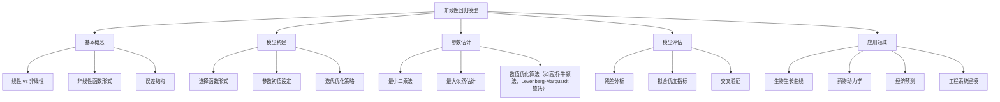

# 知识点名称：非线性回归模型

---

## 1. 概念解析

**非线性回归模型**是一种用于建模自变量与因变量之间非线性关系的统计模型。与线性回归不同，非线性回归模型的输出与输入之间的关系不能通过线性组合来表达，而是通过一个**非线性函数形式**来建模。

### 核心概念与意义：

- **非线性函数形式**：非线性回归模型的一般形式为：  
  $$
  y = f(x, \beta) + \varepsilon
  $$  
  其中，$ y $ 是因变量，$ x $ 是自变量，$ \beta $ 是模型参数，$ f(x, \beta) $ 是一个关于 $ x $ 和参数 $ \beta $ 的非线性函数，$ \varepsilon $ 是误差项。

- **适用场景**：当数据之间的关系呈现出指数增长、对数关系、S型曲线（如Logistic曲线）、多项式曲线等复杂形态时，线性模型无法准确拟合，此时需要使用非线性回归。

- **建模目标**：通过最小化误差平方和（或其它损失函数）来估计非线性函数中的参数 $ \beta $，从而找到最佳拟合函数。

- **意义与价值**：  
  - 能更准确地反映现实世界中变量之间的复杂关系；
  - 在生物、医学、工程、经济等领域中具有广泛应用；
  - 提供比线性模型更强的拟合能力和解释力。

---

## 2. 知识结构

非线性回归模型的知识体系可分为以下几个核心组成部分：

### 关键子知识点详解：

1. **非线性函数选择**：需根据数据分布、领域知识选择合适的函数形式，如指数函数、Logistic函数、多项式函数、幂函数等。
2. **参数估计方法**：
   - **最小二乘法**：最小化观测值与预测值之间的平方误差；
   - **最大似然估计**：适用于误差服从特定分布（如正态分布）；
   - **数值优化算法**：由于非线性方程无法解析求解，需借助迭代算法逼近最优解。
3. **模型评估**：
   - 残差分析：检查残差是否满足正态性、独立性、方差齐性；
   - 拟合优度：R²、调整R²、AIC、BIC等；
   - 交叉验证：评估模型在新数据上的泛化能力。

---

## 3. 教学应用

### 3.1 真实案例

#### 案例一：**药物代谢动力学建模**

- **场景描述**：研究某种药物在体内的浓度随时间变化的规律，用于确定给药剂量和频率。
- **应用过程**：
  1. 收集不同时间点的血药浓度数据；
  2. 假设药物浓度随时间呈指数衰减，建立模型：  
     $$
     C(t) = C_0 \cdot e^{-kt}
     $$  
     其中 $ C(t) $ 是时间 $ t $ 的药物浓度，$ C_0 $ 是初始浓度，$ k $ 是衰减速率；
  3. 使用非线性回归估计参数 $ C_0 $ 和 $ k $；
  4. 利用模型预测药物在不同时间点的浓度，指导临床用药。
- **价值体现**：能够准确捕捉药物代谢的非线性动态过程，为个体化治疗提供科学依据。

#### 案例二：**经济增长曲线拟合**

- **场景描述**：分析某国GDP随年份变化的趋势，预测未来经济发展。
- **应用过程**：
  1. 获取过去20年的GDP数据；
  2. 观察数据趋势，发现增长呈现S型曲线；
  3. 建立Logistic增长模型：  
     $$
     G(t) = \frac{K}{1 + e^{-a(t - t_0)}}
     $$  
     其中 $ G(t) $ 是时间 $ t $ 的GDP，$ K $ 是饱和值，$ a $ 是增长速率，$ t_0 $ 是拐点时间；
  4. 估计模型参数，进行趋势预测；
- **价值体现**：能够揭示经济增长的阶段性特征，辅助制定宏观经济政策。

---

### 3.2 常见误区与辨析

1. **误区一：非线性模型一定比线性模型好**
   - **辨析**：非线性模型适用于非线性关系，但如果数据本身接近线性，使用非线性模型反而可能过拟合，增加模型复杂度而不提升性能。

2. **误区二：非线性回归可以自动选择函数形式**
   - **辨析**：非线性回归需要人为指定函数形式，否则无法进行参数估计。函数选择应基于理论或数据特征。

3. **误区三：非线性回归参数估计简单直接**
   - **辨析**：非线性模型参数估计依赖初始值和优化算法，若初始值设置不当或函数形式不合理，可能导致收敛失败或局部最优。

4. **误区四：非线性模型可以处理任意复杂关系**
   - **辨析**：非线性模型虽然比线性模型灵活，但依然受限于所选函数的形式。若函数形式与真实关系不符，拟合效果仍会较差。

---

## 4. 学习活动设计

### 活动名称：**药物浓度曲线拟合实战**

### 活动目标：
- 理解非线性回归模型的构建流程；
- 掌握非线性回归在实际数据建模中的应用；
- 学会使用Python工具进行参数估计与模型评估。

### 活动内容与步骤：

1. **数据准备**（10分钟）  
   - 提供某药物在不同时间点的血药浓度数据（CSV格式）；
   - 使用Pandas加载数据并绘制散点图观察趋势。

2. **模型选择与构建**（15分钟）  
   - 分析数据趋势，选择合适的非线性函数形式（如指数衰减）；
   - 使用`scipy.optimize.curve_fit`进行参数估计。

3. **模型拟合与可视化**（15分钟）  
   - 绘制原始数据与拟合曲线对比图；
   - 计算拟合优度指标（如R²、AIC）。

4. **模型评估与讨论**（15分钟）  
   - 小组讨论以下问题：
     - 模型拟合是否合理？残差是否满足正态性？
     - 若改变初始参数，结果是否稳定？
     - 如何改进模型以提高预测精度？

### 所需工具/资源：

- Python环境（Jupyter Notebook）
- 库：`pandas`, `numpy`, `matplotlib`, `scipy.optimize`
- 数据集：模拟或真实药物浓度数据

---

## 5. 评估与反馈

### 1. 形成性评价问题一：简述非线性回归模型的基本形式及其参数估计方法。
- **评估标准**：
  - **优秀**：能准确写出模型形式，说明参数估计方法（如最小二乘法、数值优化）及其原理。
  - **合格**：能写出模型形式，但对估计方法理解不够深入。
  - **待提高**：无法写出模型形式或混淆参数估计方法。

### 2. 形成性评价问题二：在拟合非线性模型时，为什么需要合理设置参数的初始值？
- **评估标准**：
  - **优秀**：能说明非线性模型参数估计依赖初始值，初始值不合理可能导致不收敛或陷入局部最优。
  - **合格**：知道初始值重要，但未能解释具体原因。
  - **待提高**：认为初始值无关紧要或对非线性估计流程理解不清。

### 3. 形成性评价问题三：请分析一个你熟悉的非线性模型案例，并说明其在实际应用中的优势。
- **评估标准**：
  - **优秀**：能清晰描述案例背景、模型形式、参数估计过程及实际应用价值。
  - **合格**：能描述案例背景和模型形式，但对模型优势分析不够深入。
  - **待提高**：无法清晰描述案例或模型优势。

---