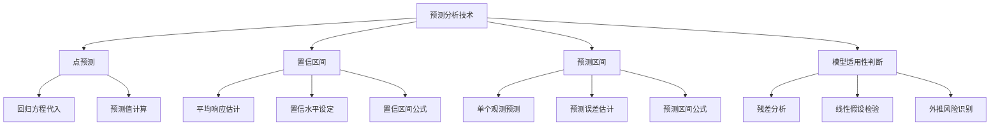

# 预测分析技术教学内容设计

---

## 1. 概念解析

### **预测分析技术**（Predictive Analytics）

预测分析技术是一种基于历史数据和统计模型，对未来趋势、行为或结果进行估计和预测的方法。在**一元线性回归模型**中，预测分析技术主要通过建立一个自变量 $ x $ 与因变量 $ y $ 之间的线性关系，来对未知的 $ y $ 值进行点预测，并结合置信区间评估预测的可靠性。

#### **核心概念与意义：**

- **点预测（Point Prediction）**：
  - 给定一个自变量 $ x $ 的具体值，利用回归方程 $ \hat{y} = \hat{\beta}_0 + \hat{\beta}_1 x $ 计算出一个具体的预测值 $ \hat{y} $。
  - 例如：若回归模型为 $ \hat{y} = 2 + 3x $，当 $ x = 5 $ 时，预测 $ y $ 为 $ 17 $。

- **置信区间（Confidence Interval）**：
  - 表示对**平均响应值**的估计区间，用于衡量预测的不确定性。
  - 例如：在 95% 置信水平下，预测值 $ \hat{y} $ 的置信区间可能是 [15.5, 18.5]。

- **预测区间（Prediction Interval）**：
  - 表示对**单个新观测值**的预测区间，比置信区间更宽，因为考虑了个体波动。
  - 例如：在 95% 预测水平下，单个新观测值的预测区间可能是 [13.2, 20.8]。

#### **意义与作用：**

- **辅助决策**：通过预测未来趋势，为商业、金融、工程等领域提供科学依据。
- **风险评估**：通过置信区间和预测区间量化预测的不确定性，有助于评估决策风险。
- **模型验证**：预测分析可用于评估模型的拟合效果，帮助发现模型的不足。

---

## 2. 知识结构

### **关键子知识点详解：**

| 子知识点 | 内容说明 |
|----------|----------|
| **点预测** | 使用回归模型对特定 $ x $ 值进行 $ y $ 的估计，是最基础的预测方式。 |
| **置信区间** | 用于估计在特定 $ x $ 下，$ y $ 的平均值可能的范围，反映预测的稳定性。 |
| **预测区间** | 更宽的区间，用于估计单个新数据点的取值范围，反映预测的不确定性。 |
| **模型适用性判断** | 包括残差分析、线性检验、是否存在异方差性等，确保预测结果可靠。 |

---

## 3. 教学应用

### **3.1 真实案例**

#### **案例一：广告投入与销售额预测**

- **场景描述**：某公司希望根据广告投入金额（万元）预测下月销售额（万元）。
- **应用过程**：
  1. 收集过去12个月的广告投入与销售额数据；
  2. 建立一元线性回归模型：销售额 = β₀ + β₁ × 广告投入；
  3. 若下月广告预算为 10 万元，代入模型得到预测销售额为 120 万元；
  4. 同时计算 95% 置信区间 [115, 125] 和预测区间 [105, 135]，用于评估预测的可信度和个体波动。

- **价值体现**：帮助公司科学制定预算，合理预期收益，同时识别潜在风险。

#### **案例二：学生复习时间与考试成绩预测**

- **场景描述**：教师希望根据学生的复习时间（小时）预测其考试成绩（分）。
- **应用过程**：
  1. 收集若干学生复习时间与成绩数据；
  2. 构建回归模型，预测某学生复习 20 小时后可能的成绩；
  3. 计算预测值及区间，用于指导个性化学习建议。

- **价值体现**：提供个性化的学习反馈，帮助学生调整学习策略。

---

### **3.2 常见误区与辨析**

| 误区 | 正确认识 | 辨析方法 |
|------|----------|----------|
| 误将点预测当作唯一结果 | 点预测只是估计值，真实值可能在预测区间内 | 结合置信区间和预测区间全面理解预测结果 |
| 混淆置信区间与预测区间 | 置信区间用于平均值，预测区间用于个体值 | 明确区间用途，理解其统计含义 |
| 忽视模型适用性 | 若模型不满足线性、独立性等假设，预测不可靠 | 进行残差分析和模型诊断 |
| 在模型外推区域进行预测 | 外推可能导致预测偏差大 | 仅在数据范围内进行预测，避免盲目外推 |

---

## 4. 学习活动设计

### **活动名称：房价预测中的置信与预测区间分析**

#### **活动目标：**
- 掌握一元线性回归模型中点预测、置信区间和预测区间的计算方法；
- 理解不同区间的意义；
- 学会使用统计软件（如 Excel、Python）进行实际操作。

#### **活动内容与步骤：**

1. **数据导入与模型建立（15分钟）**
   - 提供一组房屋面积（平方米）与价格（万元）的数据；
   - 使用 Excel 或 Python（如 `statsmodels` 或 `scikit-learn`）建立一元线性回归模型。

2. **点预测与区间计算（20分钟）**
   - 选择一个房屋面积（如 90 平方米），计算其房价点预测值；
   - 分别计算 95% 置信区间和预测区间；
   - 观察不同置信水平（如 90%、95%、99%）对区间宽度的影响。

3. **讨论与反思（15分钟）**
   - 小组讨论以下问题：
     - 置信区间和预测区间哪个更宽？为什么？
     - 如果房屋面积超出数据范围，预测是否可信？
     - 如何判断模型是否适合用于预测？

4. **汇报与总结（10分钟）**
   - 每组选派代表分享预测结果与分析结论；
   - 教师点评并总结关键要点。

#### **所需工具/资源：**
- Excel 或 Python 环境（Jupyter Notebook）
- 数据集（可使用公开房价数据或模拟数据）
- 示例代码模板（如 Python 中使用 `statsmodels` 的 `get_prediction` 方法）

---

## 5. 评估与反馈

### **形成性评价问题：**

1. **解释置信区间与预测区间的区别。**
   - **评估标准：**
     - 优秀：能准确指出置信区间用于平均响应，预测区间用于个体值，且后者更宽；
     - 合格：能识别两者为不同类型的区间，但解释不够清晰；
     - 待提高：混淆两个概念，或认为它们是相同的。

2. **如果一个预测值的置信区间非常宽，这说明了什么？**
   - **评估标准：**
     - 优秀：能指出数据波动大、样本量小或模型拟合不佳，导致预测不确定性高；
     - 合格：能意识到预测不确定性高，但原因分析不完整；
     - 待提高：无法正确解释区间宽度的意义。

3. **在模型外推区域进行预测是否合理？为什么？**
   - **评估标准：**
     - 优秀：能指出外推可能导致模型失效，因为无法保证线性关系继续成立；
     - 合格：意识到外推有风险，但解释不够深入；
     - 待提高：认为外推是合理的，或未意识到其潜在问题。

---

> **教学提示：**  
> 在讲解过程中，建议使用可视化工具（如散点图+回归线+置信带）帮助学员直观理解预测分析技术的统计意义。同时，鼓励学员动手操作，提升其实际应用能力。