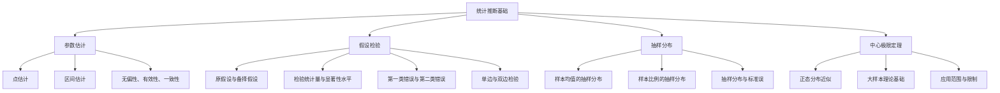

# 统计推断基础教程

---

## 1. 概念解析

**统计推断**（Statistical Inference）是统计学中的核心内容之一，指从样本数据中推断总体特征的过程。它在计量经济学中具有基础性地位，是进行实证分析、模型估计与检验的理论依据。

### 核心概念与意义

- **总体与样本**：总体是我们研究对象的全部个体集合，而样本是从总体中抽取的一部分，用于对总体进行估计或推断。
- **参数估计**：通过样本数据对总体未知参数（如均值、方差、回归系数等）进行估计，常用方法包括点估计（如样本均值）和区间估计（如置信区间）。
- **假设检验**：用于判断某个关于总体参数的假设是否成立。通过样本数据计算检验统计量，并与临界值比较，决定是否拒绝原假设。
- **抽样分布**：样本统计量（如样本均值）在不同样本下的分布情况，是统计推断的理论基础。
- **中心极限定理**：即使总体分布未知，只要样本容量足够大，样本均值的抽样分布近似服从正态分布，这是许多统计方法（如t检验、z检验）成立的理论依据。

### 在计量经济学中的意义

- **模型估计与检验**：回归分析中的参数估计（如OLS估计）和显著性检验（如t检验）都依赖统计推断。
- **因果推断基础**：在实证研究中，通过样本数据推断变量之间的因果关系，离不开统计推断的理论支撑。
- **决策支持**：通过置信区间和假设检验，为政策制定、经济预测等提供科学依据。

---

## 2. 知识结构

### 关键子知识点详解

1. **点估计 vs 区间估计**
   - 点估计给出一个具体数值（如样本均值作为总体均值的估计）；
   - 区间估计给出一个范围（如95%置信区间），表示参数落在该区间的概率为95%。

2. **假设检验步骤**
   - 建立原假设（H₀）与备择假设（H₁）；
   - 选择检验统计量（如z统计量、t统计量）；
   - 确定显著性水平（如α=0.05）；
   - 计算p值或比较统计量与临界值；
   - 得出是否拒绝原假设的结论。

3. **中心极限定理应用**
   - 无论总体分布如何，当样本容量足够大时，样本均值近似服从正态分布；
   - 该定理为使用z检验、t检验提供了理论依据。

---

## 3. 教学应用

### 3.1 真实案例

#### 案例一：消费者支出调查（区间估计）

- **场景描述**：某城市统计局想了解居民月均消费支出，随机抽取1000名居民，计算得样本均值为¥3500，标准差为¥800。
- **应用过程**：
  1. 使用中心极限定理，构建总体均值的95%置信区间；
  2. 得出区间：3500 ± 1.96 × (800/√1000) ≈ [3450.4, 3549.6]；
  3. 结论：有95%的把握认为居民月均消费支出在3450元至3550元之间。
- **价值体现**：通过样本数据对总体特征进行合理估计，为政府制定消费刺激政策提供依据。

#### 案例二：新药效果验证（假设检验）

- **场景描述**：某制药公司开发一种新降压药，声称平均降低血压5mmHg以上。随机抽取200人服用药物，测得平均降低4.2mmHg，标准差为3.1mmHg。
- **应用过程**：
  1. 建立假设：H₀: μ ≤ 5；H₁: μ > 5；
  2. 计算t统计量：(4.2 - 5)/(3.1/√200) ≈ -3.62；
  3. 查t分布表，得出p值小于0.01；
  4. 结论：拒绝H₀，认为该药平均降压效果未达5mmHg。
- **价值体现**：通过科学方法验证药效，为药品审批提供统计依据。

---

### 3.2 常见误区与辨析

| 误区编号 | 误区描述 | 辨析方法 |
|----------|-----------|-----------|
| 误区一 | 置信区间意味着“95%的数据落在该区间内” | 实际上，置信区间是对总体参数的估计，不是对数据本身的覆盖范围。 |
| 误区二 | p值小于0.05就一定具有实际意义 | p值反映统计显著性，但不等于实际重要性。应结合效应量（effect size）评估。 |
| 误区三 | 样本越大，假设检验越容易通过 | 样本量大时，即使微小差异也可能显著，但实际意义可能不大。应结合实际背景判断。 |
| 误区四 | 中心极限定理适用于所有小样本 | 中心极限定理依赖大样本，小样本下需依赖总体分布假设（如正态性）。 |

---

## 4. 学习活动设计

### 活动名称：咖啡店顾客满意度调查分析

### 活动目标：

- 理解并应用统计推断中的点估计、区间估计和假设检验；
- 提升使用统计工具（如Excel或Python）进行数据分析的能力。

### 活动内容与步骤：

1. **数据准备（10分钟）**
   - 提供某连锁咖啡店顾客满意度调查数据（样本量n=200，满意度评分1-10分）。
   - 学员使用Excel或Python（Pandas）计算样本均值、标准差。

2. **区间估计（15分钟）**
   - 构建总体平均满意度的95%置信区间；
   - 分析该区间是否包含8分，判断顾客整体满意度是否达标。

3. **假设检验（20分钟）**
   - 原假设H₀：平均满意度≤7.5；
   - 备择假设H₁：平均满意度>7.5；
   - 计算t统计量并查表判断是否拒绝H₀；
   - 分析结果对店铺改进策略的意义。

4. **小组讨论与汇报（15分钟）**
   - 讨论问题：
     - 如果样本量增加到1000，置信区间会如何变化？
     - 如果p值为0.03，是否应建议提高服务质量？
   - 每组汇报分析过程与结论。

### 所需工具/资源：

- 数据集：Excel表格或CSV格式
- 工具：Excel 或 Python（Jupyter Notebook + Pandas + SciPy）
- 知识点回顾：统计推断基本公式与方法

---

## 5. 评估与反馈

### 形成性评价问题一：解释置信区间的含义。

- **评估标准**：
  - **优秀**：能准确说明置信区间是总体参数的可能取值范围，并指出其概率解释（如95%的置信度表示在多次抽样中，95%的区间包含真实参数）。
  - **合格**：理解置信区间是对总体参数的估计，但对概率解释模糊。
  - **待提高**：误认为置信区间表示“95%的数据落在区间内”。

### 形成性评价问题二：如何判断一个假设检验是否拒绝原假设？

- **评估标准**：
  - **优秀**：能说明通过比较检验统计量与临界值，或通过p值与显著性水平比较，来判断是否拒绝原假设，并能解释第一类错误和第二类错误。
  - **合格**：能说出p值小于显著性水平时拒绝原假设，但对错误类型理解不清。
  - **待提高**：仅凭直觉判断拒绝与否，缺乏统计依据。

### 形成性评价问题三：如果样本量很小，是否还能使用t检验？为什么？

- **评估标准**：
  - **优秀**：能指出t检验适用于小样本，但要求数据近似正态分布；若不满足，应使用非参数检验。
  - **合格**：知道t检验可用于小样本，但未说明前提条件。
  - **待提高**：误认为小样本不能使用任何统计检验。

--- 

如需进一步扩展教学内容，如引入Bootstrap方法、贝叶斯推断等进阶主题，也可作为后续课程的衔接。