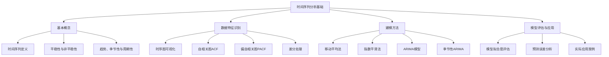

# 知识点名称：时间序列分析基础

---

## 1. 概念解析

**时间序列分析（Time Series Analysis）** 是统计学与数据分析中的一个重要分支，专注于对**按时间顺序排列的数据点**进行建模、分析和预测。这些数据点通常具有**时间依赖性**，即当前观测值与过去值之间存在某种关联。

### 核心概念与意义：

- **时间序列（Time Series）**：是指按照时间顺序排列的一组数据点，通常以等时间间隔（如每天、每小时）记录。例如：股票价格、气温变化、销售数据等。

- **时间序列分析的目标**：
  - 描述数据随时间变化的趋势和模式；
  - 分析数据的周期性、季节性、趋势性等特征；
  - 建立模型进行预测，辅助决策制定。

- **模型构建序列分析**能力是本单元的核心培养目标，强调学员能够根据实际数据特征选择合适的模型（如ARIMA、指数平滑、LSTM等），并进行模型训练、评估与优化。

### 在领域中的意义与作用：

- **预测未来**：在金融、气象、供应链、医疗等领域，对未来趋势的准确预测具有重大价值。
- **识别模式**：帮助识别数据中的周期性、趋势、异常等，为业务分析提供依据。
- **支持决策**：基于分析结果，企业可以优化资源配置、制定营销策略、防范风险等。

---

## 2. 知识结构

### 关键子知识点详解：

1. **平稳性**：时间序列是否具有统计特性不随时间改变的性质。平稳序列是许多模型（如ARIMA）的前提条件。
2. **趋势（Trend）**：长期变化的方向，如上升或下降。
3. **季节性（Seasonality）**：周期性重复的变化，如月度销售高峰。
4. **周期性（Cyclic）**：非固定周期的波动，如经济周期。
5. **差分（Differencing）**：用于去除趋势和季节性，使序列平稳。
6. **ACF与PACF**：用于识别序列的自相关结构，辅助选择ARIMA参数。

---

## 3. 教学应用

### 3.1 真实案例

#### 案例一：零售销售预测

- **场景描述**：某连锁超市希望根据历史销售数据预测下季度的销售额，以优化采购与库存。
- **应用过程**：
  1. 收集过去三年每日销售数据；
  2. 通过时序图观察趋势与季节性；
  3. 利用ACF和PACF判断模型类型；
  4. 构建ARIMA模型并进行差分处理；
  5. 预测未来90天销售数据；
  6. 评估预测误差（如MAE、RMSE）。
- **价值体现**：通过时间序列模型，企业可提前预判销售高峰与低谷，优化库存与营销策略，降低运营成本。

#### 案例二：股票价格趋势分析

- **场景描述**：投资者希望了解某只股票价格的历史波动规律，辅助投资决策。
- **应用过程**：
  1. 获取某公司过去五年的收盘价数据；
  2. 绘制股价走势图，识别趋势与波动；
  3. 使用指数平滑或ARIMA模型对股价趋势进行拟合；
  4. 分析模型残差，识别异常波动；
- **价值体现**：虽然股价受多种因素影响难以精确预测，但时间序列分析能揭示潜在趋势，辅助制定投资策略。

---

### 3.2 常见误区与辨析

| 误区编号 | 常见误解 | 正确认知与辨析 |
|----------|----------|----------------|
| 1 | 所有时间序列都可以直接建模预测 | 实际上，非平稳、噪声大或数据量不足的序列需先进行平稳化处理（如差分、去趋势） |
| 2 | 模型越复杂预测越准确 | 模型应与数据复杂度匹配，过度复杂的模型可能导致过拟合，反而降低预测性能 |
| 3 | 时间序列分析只能用于预测 | 除预测外，还可用于异常检测、趋势识别、因果分析等 |
| 4 | 不需要理解数据背景，直接建模 | 数据背景（如业务周期、节假日效应）对建模与结果解释至关重要 |

---

## 4. 学习活动设计

### 活动名称：超市月度销售预测实战

#### 活动目标：

- 巩固时间序列分析基础知识；
- 掌握ARIMA模型的基本建模流程；
- 提升“模型构建序列分析”能力。

#### 活动内容与步骤：

1. **数据探索与预处理（20分钟）**
   - 提供某超市过去三年的月度销售数据；
   - 学员使用Python（Pandas、Matplotlib）绘制时序图；
   - 检查缺失值、平滑处理、差分处理。

2. **特征识别与模型选择（15分钟）**
   - 绘制ACF与PACF图；
   - 识别序列是否平稳，是否具有季节性；
   - 选择合适的模型（如ARIMA或SARIMA）。

3. **模型训练与预测（20分钟）**
   - 划分训练集与测试集（前30个月为训练集，后6个月为测试集）；
   - 使用statsmodels库训练ARIMA模型；
   - 预测未来6个月销售额。

4. **模型评估与讨论（25分钟）**
   - 计算预测误差（如MAE、RMSE）；
   - 可视化预测值与真实值对比；
   - 小组讨论以下问题：
     - 为什么需要进行差分？
     - ARIMA模型适用于哪些类型的时间序列？
     - 如何判断模型是否过拟合？

#### 所需工具/资源：

- Python环境（Jupyter Notebook）
- 库：`pandas`, `matplotlib`, `statsmodels`, `numpy`
- 数据集：虚构的超市月度销售数据（CSV格式）

---

## 5. 评估与反馈

### 形成性评价问题一：

**请解释时间序列分析中“平稳性”的含义及其重要性。**

- **评估标准**：
  - **优秀**：能准确解释平稳性指均值、方差不随时间变化，且协方差仅与时间间隔有关；说明其对ARIMA等模型的建模前提作用。
  - **合格**：能描述平稳性与趋势、季节性的关系，但对模型影响理解不够深入。
  - **待提高**：混淆平稳性与其他时间序列特征，或无法说明其意义。

---

### 形成性评价问题二：

**如何通过ACF与PACF图识别ARIMA模型的p和q参数？**

- **评估标准**：
  - **优秀**：能指出ACF截尾对应MA(q)，PACF截尾对应AR(p)，并结合拖尾特征判断模型阶数。
  - **合格**：知道ACF与PACF用于识别模型参数，但描述不够准确。
  - **待提高**：不了解ACF/PACF的作用或误判其含义。

---

### 形成性评价问题三：

**如果一个时间序列模型在训练集上表现良好但在测试集上误差较大，可能是什么原因？你应如何调整模型？**

- **评估标准**：
  - **优秀**：能识别为过拟合现象，并提出减少模型复杂度（如降低p、q）、引入正则化、增加数据量等策略。
  - **合格**：能意识到模型性能差异，但调整策略不够系统或准确。
  - **待提高**：无法判断模型问题或提出错误的调整方向（如继续增加复杂度）。

--- 